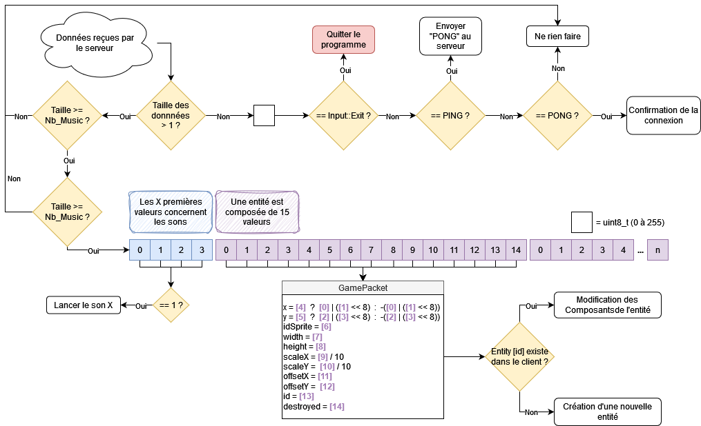

# Client Communication Protocol

This graph explains in details how our `UDPClient` class :

- communicates with a `Server` class via an UDP protocol
- handles the user's keyboard inputs in the menu and the game
- handles the music and sound effects in the menu and the game
- serializes and deserializes the `GamePackets` to create, update and delete game entities when necessary

## Graph

