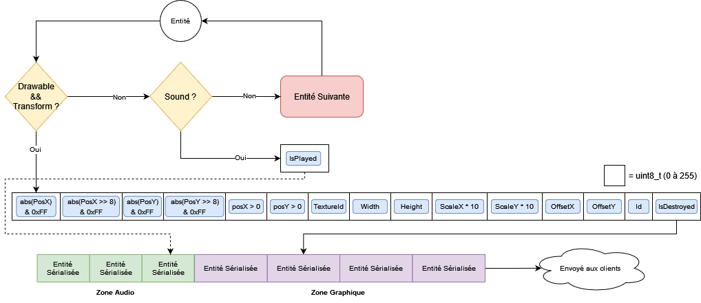

# Server Communication Protocol

This graph explains in details how our `Server` class:

- communicates with its clients via an UDP protocol
- handles all our game's entities (create, delete them and update their states)
- serializes the entities's informations so that our clients can create, update and delete game entities when necessary

## Graph

