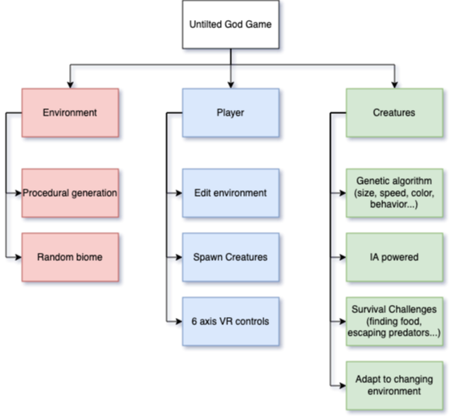

# Untitled God Game (ESP)

## Project Description (50 words)

*Untitled God Game* is a procedurally generated virtual reality game where players assume the role of a god, dynamically interacting with the world's elements. It features AI-driven creatures that evolve through natural selection, influenced by environmental factors, creating a living, ever-changing ecosystem.

## PBS

## Detailled PBS

1. Environment
    - Develop algorithms for generating unique terrains, including mountains, valleys, oceans, forests, and deserts.
    - Implement a variety of biomes with distinct flora and fauna.
    - Allow for random placement of resources, landmarks, and hidden areas.
2. Player
    - Enable terraforming powers, such as raising or lowering land, creating water bodies, and spawning vegetation.
    - Introduce weather control abilities like summoning rain, storms, or droughts.
    - Provide a 'miracle' system where players can perform extraordinary acts impacting the world or creatures.
    - Develop gesture-based controls for VR, allowing natural and intuitive player interaction.
3. Creatures
    - Design creatures with a genetic algorithm that determines traits like size, speed, color, and behavior.
    - Create a breeding system where offspring inherit and mutate characteristics.
    - Implement survival challenges like finding food, escaping predators, and adapting to changing environments.
    - Develop a food chain hierarchy, including herbivores, carnivores, omnivores, and apex predators.
