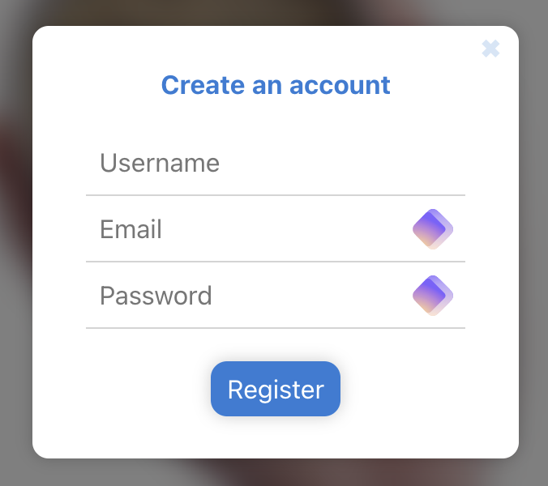
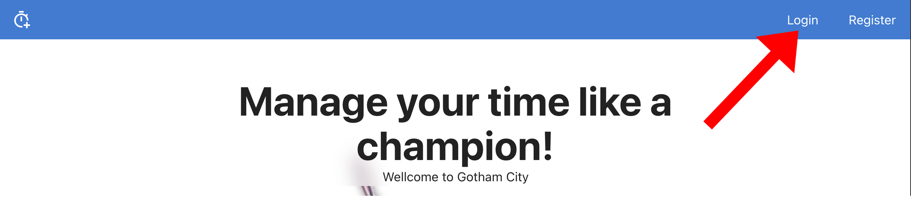
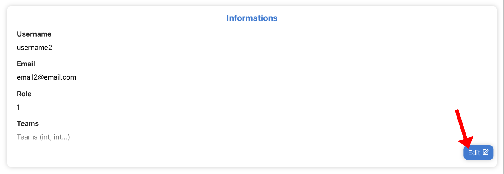
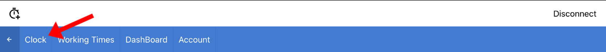
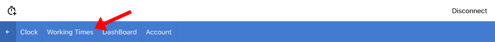
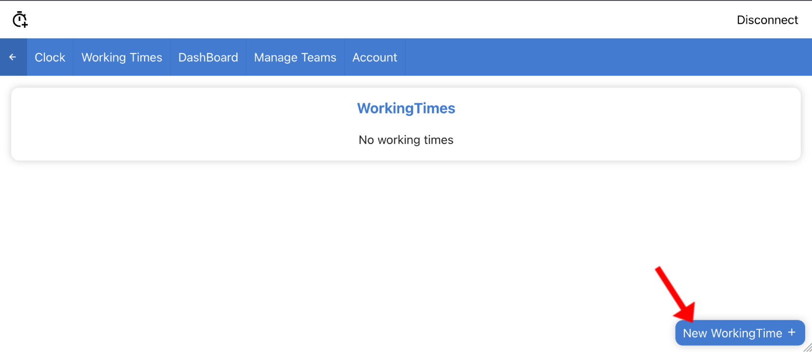

# How To: Timer Manager

## Create an account

Before using Timer Manager, you need to create an account on the platform. In this section, you'll find all the information you need to create an account.

1. Click on the "Register" button in the top right-hand corner of your browser/application.

2. Fill in the window that has just opened with your username, email address and password.

<aside>
⚠️ Username and email must be unique. If another user has an account with either information identical to yours, change your data or contact a manager.

</aside>

<aside>
⚠️ By default, you'll get the "simple user" role. If you wish to obtain a "manager" or "super manager" role, contact your referring super manager.

</aside>

## Manage your account

In this section, you'll find all the information you need to access your account information and modify your personal data.

1. Log in to your account by clicking on the "Login" button in the top right-hand corner of your browser/application.

2. Click on the "Account" button in the navigation bar (or go to the url */account*)

[Login form](pictures/image.psd.png)

3. Your account information is available here (excluding password for security reasons).

4. To modify your information, click on the "Edit" button at the bottom right of the information card.

5. You can now modify your username and email address. Once you've finished, simply press the "Save" button to confirm.

<aside>
⚠️ Role and team modification is only possible by a manager or super manager. For more information, please contact your referring super manager.

</aside>

## Register a time

In this section, you'll find the information you need to use the activity timer.

1. Log in to your account by clicking on the "Login" button in the top right-hand corner of your browser/application.

2. Click on the "Clock" button in the navigation bar (or go to the url */clock*)

3. To launch your activity timer, simply press the button in the center of the page.

<aside>
⚠️ Once the stopwatch has started, you can exit Time Manager. The time continues to calculate even if you're no longer connected to the internet.

</aside>

1. Once your working time is over (lunch break, end of day...), simply click on the green button in the center to stop the stopwatch and validate your working time.

<aside>
⚠️ If the time displayed doesn't seem valid, you can click on the button at the top right of the map to update the stopwatch.

[Update the stopwatch](pictures/image.psd9.png)

</aside>

# See your working times

In this section, you'll find all the information you need to find and manage your working times.

1. Login to your account by clicking on the "Login" button in the top right-hand corner of your browser/application.

2. Click on the "Working Times" button in the navigation bar (or go to the url */workingTimes*)

3. You'll then see a complete list of your working times.

<aside>
⚠️ At the top right of each line is a colored dot. If the pastille is red, contact your manager to correct this anomaly.

</aside>

1. By clicking on a WorkingTime, you can view its information in greater detail.

<aside>
⚠️ A classic user cannot modify or delete working times. If you wish to make a change, please contact your manager.

</aside>

## See your dashboard

In this section, you'll find the information you need to view your working times in graphical form.

1. Log in to your account by clicking on the "Login" button in the top right-hand corner of your browser/application.

2. Click on the "Dashboard" button in the navigation bar (or go to the url */chartManager*)

3. You can now see your working hours in graphical form.
    * "Total per month (/hour)" : Displays cumulative working time by month.
    * "Mean per week day (/hour): Displays average working time by day of the week.
    * "Time per days (/hour): Displays daily working time.

4. You can change the data period by hovering your mouse over the magnifying glass at the bottom left of your computer screen.

## [Manager] See the informations of your teams members

<aside>
⚠️ This section is still being created. Its use is therefore not yet optimal and is subject to many changes.

</aside>

1. Log in to your account by clicking on the "Login" button in the top right-hand corner of your browser/application.

2. Go to the following url: `/user/{user ID}`
    * As manager, you'll be able to modify the user's teams (number, number, number format).
    * As super manager, you'll be able to modify the user's teams (format number, number, number) and change his role (1 → simple user, 2 → manager, 3 → super manager). You can also delete the user's account by clicking on the button at the bottom right of the screen.

## [Manager] See the dashboard of your teams members

<aside>
⚠️ This section is still being created. Its use is therefore not yet optimal and is subject to many changes.

</aside>

1. Log in to your account by clicking on the "Login" button in the top right-hand corner of your browser/application.

2. Go to the following url: `/chartmanager/{userid}`
    1. The possible actions are identical to those of a standard user, so go to the corresponding section of this document.

## [Manager] Create missing working times for your teams members

<aside>
⚠️ This section is still being created. Its use is therefore not yet optimal and is subject to many changes.

</aside>

1. Log in to your account by clicking on the "Login" button in the top right-hand corner of your browser/application.

1. Go to the following url: `/workingtimes/{userid}`
    * On this page, you can view the working times of the user concerned.
2. Click on the "New Working Time" button at the bottom right of the page.

1. A new page opens, with working time set to the current time. You can then click on "Edit" to modify it or on "Delete WorkingTime" to delete it.

## [Manager] Create and manage teams

<aside>
⚠️ This section is still being created. Its use is therefore not yet optimal and is subject to many changes.

</aside>

1. Log in to your account by clicking on the "Login" button in the top right-hand corner of your browser/application.

2. Click on the "Manager Teams" button in the navigation bar (or go to the url */manager*)

Several options are available on this new page

1 "Create a new team": you can create a new team by giving it a name and assigning a manager. The manager must have an account on the application for the team to be valid.

2. "Remove a team": you can remove an existing team from the list in the center of the map.

       

<aside>
⚠️ For the moment, deleting a team does not delete its users.
        
</aside>
        
3. "Add user to a team": you can add a user to a team by entering their email and selecting the team from the drop-down list.

<aside>
⚠️ This option is still under development. You can use an equivalent by going to a user's page and entering their teams manually.

</aside>
