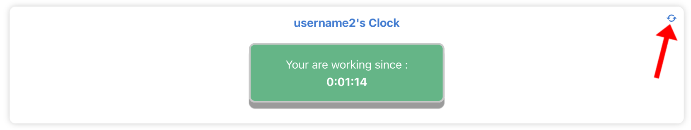

# Tutoriel: Timer Manager

## Créer un compte

Avant toute utilisation de Timer Manager, il est nécessaire de créer un compte sur la plateforme. Dans cette section, vous trouverez toutes les informations nécessaires pour y parvenir.

1. Cliquez sur le bouton “Register” en haut à droite de votre navigateur/application.

1. Remplissez la fenêtre qui vient de s’ouvrir avec votre nom d’utilisateur, votre email ainsi que d’un mot de passe.

<aside>
⚠️ Le nom d’utilisateur et l’email doivent être uniques. Si un autre utilisateur possède un compte avec l’une des deux informations identiques aux vôtres, modifiez vos données ou contactez un manager.

</aside>

<aside>
⚠️ Par défaut, vous obtiendrez le rôle de simple utilisateur. Si vous souhaitez obtenir un rôle “manager” ou “super manager”, contactez votre super manager référant.

</aside>

## Gérer votre compte

Dans cette section, vous trouverez toutes les informations nécessaires accéder aux informations de votre compte et sur la modification de vos données personnelles.

1. Connectez-vous à votre compte en cliquant sur le bouton “Login” en haut à droite de votre navigateur/application.

1. Cliquez sur le bouton “Account” présent dans la barre de navigation (ou rendez-vous sur l’url */account*)

1. Les informations de votre compte sont disponibles ici (hors mot de passe pour des questions de sécurité).

1. Pour modifier vos informations, cliquez sur le bouton “Edit” en bas à droite de la carte d’informations.

1. Vous pouvez alors modifier votre username et votre email. Une fois terminé, vous n’avez qu’à appuyer sur le bouton “Save” pour valider.

<aside>
⚠️ La modification du rôle et des équipes n’est possible que par un manager ou un super manager. Pour plus d’informations, vous pouvez contacter votre super manager référant.

</aside>

## Utiliser le chronomètre

Dans cette section, vous trouverez les informations nécessaires sur l’utilisation du chronomètre d’activité.

1. Connectez-vous à votre compte en cliquant sur le bouton “Login” en haut à droite de votre navigateur/application.

1. Cliquez sur le bouton “Clock” présent dans la barre de navigation (ou rendez-vous sur l’url */clock*)

1. Pour lancer votre chronomètre d’activité, vous n’avez plus qu’à appuyez sur le bouton au centre de la page.

<aside>
⚠️ Une fois le chronomètre lancé, vous pouvez quitter le Time Manager. Le temps continue de se calculer même si vous n’êtes plus connecté à internet.

</aside>

1. Une fois votre temps de travail terminé (pause du midi, fin de journée…), cliquez simplement sur le bouton vert au centre pour arrêter le chronomètre et ainsi valider votre temps de travail.

<aside>
⚠️ Si le temps affiché ne vous semble pas valide, vous pouvez cliquer sur le bouton en haut à droite de la carte pour actualiser le chronomètre.

</aside>

## Voir ses temps de travail

Dans cette section, vous trouverez les informations nécessaires pour retrouver et gérer vos temps de travail.

1. Connectez-vous à votre compte en cliquant sur le bouton “Login” en haut à droite de votre navigateur/application.

1. Cliquez sur le bouton “Working Times” présent dans la barre de navigation (ou rendez-vous sur l’url */workingTimes*)

1. Vous verrez alors la liste complète de vos temps de travail.

<aside>
⚠️ Une pastille de couleur se trouve en haut à droite de chaque ligne. Si la pastille est rouge, contactez votre manager pour corriger cette anomalie.

</aside>

1. En cliquant sur un WorkingTime, vous pourrez visualiser plus en détails ses informations.

<aside>
⚠️ Un utilisateur classique ne peut pas modifier ou supprimer ses temps de travail. Si vous souhaitez apporter une modification, contactez votre manager.

</aside>

## Voir son DashBoard

Dans cette section, vous trouverez les informations nécessaires pour visualiser vos temps de travail sous forme de graphiques.

1. Connectez-vous à votre compte en cliquant sur le bouton “Login” en haut à droite de votre navigateur/application.

1. Cliquez sur le bouton “Dashboard” présent dans la barre de navigation (ou rendez-vous sur l’url */chartManager*)

1. Vous pouvez voir dès à présent vos temps de travail sous forme de graphiques.
    1. “Total per month (/hour)” : Affiche le cumul par mois du temps de travail.
    2. “Mean per week day (/hour)” : Affiche la moyenne du temps de travail en fonction des jours de la semaine.
    3. “Time per days (/hour)” : Affiche le temps de travail quotidien.

1. Vous pouvez changer la période des données en utilisant le formulaire présent en bas de votre écran.

## [Manager] Voir les informations des membres de ses équipes

1. Connectez-vous à votre compte en cliquant sur le bouton “Login” en haut à droite de votre navigateur/application.

1. Rendez vous sur la page User correspondante à l’utilisateur souhaité :
    1. En passant par vos équipes :
        1. Cliquez sur l’onglet “Teams”
            
            
            
        2. Trouver l’utilisateur souhaité dans vos équipes et cliquez sur le bouton indiqué par la flèche. 
            
            
            
    2. En vous rendant sur l’url suivant : `/user/{id de l’utilisateur}`
2. Plusieurs actions sont alors possibles :
    1. En tant que manager, vous pourrez modifier les équipes de l’utilisateur (format nombre, nombre, nombre).
    2. En tant que super manager, vous pourrez modifier les équipes de l’utilisateur (format nombre, nombre, nombre) et changer son rôle (1 → utilisateur simple, 2 → manager, 3 → super manager). Vous pourrez également supprimer le compte de l’utilisateur en cliquant sur le bouton en bas à droite de l’écran.

## [Manager] Voir les DashBoards des membres de ses équipes

1. Connectez-vous à votre compte en cliquant sur le bouton “Login” en haut à droite de votre navigateur/application.

1. Rendez vous sur la page ChartManager correspondante à l’utilisateur souhaité :
    1. En passant par vos équipes :
        1. Cliquez sur l’onglet “Teams”
            
            
            
        2. Trouver l’utilisateur souhaité dans vos équipes et cliquez sur le bouton indiqué par la flèche. 
            
            
            
    2. En vous rendant sur l’url suivant : `/chartmanager/{id de l’utilisateur}`

4. Les actions possibles sont identiques à celles d’un utilisateur classique, rendez-vous donc dans la section correspondante de ce document.

## [Manager] Ajouter un temps de travail à un membre de ses équipes

1. Connectez-vous à votre compte en cliquant sur le bouton “Login” en haut à droite de votre navigateur/application.

1. Rendez vous sur la page des Working Times de l’utilisateur souhaité :
    1. En passant par vos équipes :
        1. Cliquez sur l’onglet “Teams”
            
            
            
        2. Trouver l’utilisateur souhaité dans vos équipes et cliquez sur le bouton indiqué par la flèche.
            
            
            
    2. En vous rendant sur l’url suivant : `/workingtimes/{id de l’utilisateur}`
2. Cliquez sur le bouton “New Working Time” présent en bas à droite de la page.

1. Une nouvelle page s’ouvre avec un working time initialisé à l’heure actuelle. Vous pouvez alors cliquer sur “Edit” pour le modifier ou sur “Delete WorkingTime” pour le supprimer.

## [Manager] Créer et gérer les équipes

1. Connectez-vous à votre compte en cliquant sur le bouton “Login” en haut à droite de votre navigateur/application.

1. Cliquez sur le bouton “Manager Teams” présent dans la barre de navigation (ou rendez-vous sur l’url */manager*)

1. Plusieurs options s’offrent à vous sur cette nouvelle page
    1. “Create a new team” : vous pouvez créer une nouvelle équipe en lui donnant un nom et en assignant un manager. Le manager doit posséder un compte sur l’application pour que l’équipe soit valide (il sera automatiquement ajouté comme membre de l’équipe pendant la création de cette dernière).
        
        
        
    2. “Teams”: permet de voir toutes les équipes de l’application ainsi que de les supprimer en cliquant sur le bouton rouge.
        
        
        
    3. “Add user to teams”: En renseignant le mail d’un utilisateur et en sélectionnant une équipe dans la liste déroulante, vous pouvez assigner n’importe quel utilisateur à une équipe.
        
        